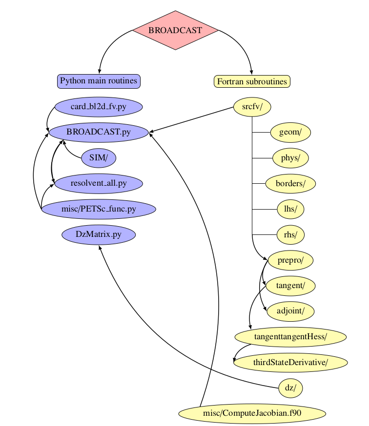
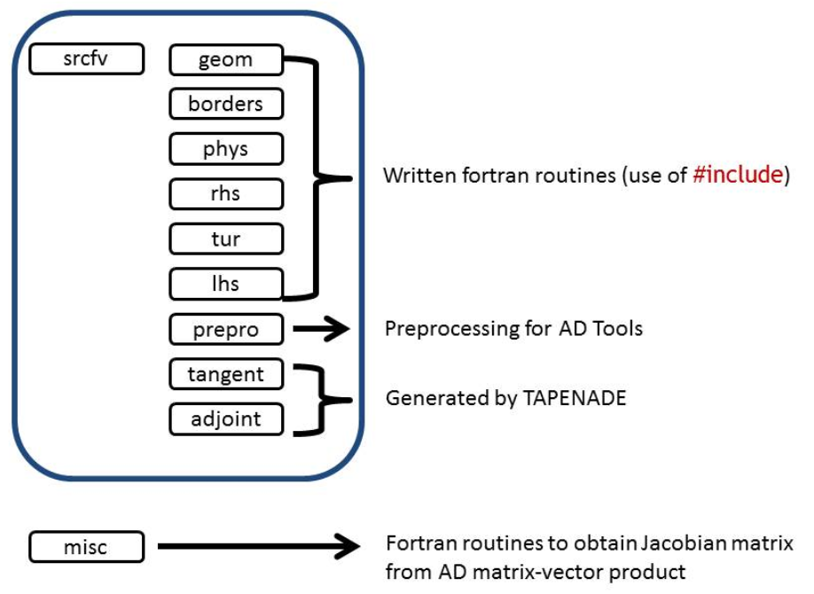

Usage
=====

Languages
---------

* Python: main programs and user-interface.
* FORTRAN: sub-routines for computational efficiency.

Linear systems are solved through PETSc/SLEPc libraries.

.. note::

   Users need to be familiar with Python, developers may need to have a basic knowledge of FORTRAN.

.. _installation:

Installation
------------

To use BROADCAST, the following Python packages are required:

* numpy
* scipy
* matplotlib
* psutil
* mpi4py
* petsc4py (installed in *complex*)
* slepc4py (installed in *complex*)

.. note::

   Developers which update the FORTRAN sources of BROADCAST need the Algorithmic Differentation tool **TAPENADE**. The `tapenade <http://www-tapenade.inria.fr:8080/tapenade/index.jsp>`_ web server can be used to linearise FORTRAN routines without requiring to install TAPENADE.

An example of installation of the required packages is shown below through *anaconda*:

.. code-block:: console

   $ module load anaconda
   $ anaconda-setup
   $ conda create -n ENV_NAME
   $ source activate ENV_NAME
   (ENV_NAME) $ conda install numpy scipy matplotlib psutil mpi4py petsc=*=*complex* petsc4py slepc=*=*complex* slepc4py

Once the packages installed, to install BROADCAST, run the following compile command in the **three** folders **./**, **./misc/** and **./srcfv/**:

.. code-block:: console

   (ENV_NAME) [.]$ python compilef90.py
   (ENV_NAME) [./misc]$ python compile_misc.py
   (ENV_NAME) [./srcfv]$ ./compile_all.sh

Implementation
--------------

Program files
--------------

List of the programs and their description available: :ref:`listprogram`.

Update and linearisation of FORTRAN source routines
----------

Routines stored in *tangent* are linearised from the folder *prepro*. Routines in *prepro* are generated from sub-routines in *phys*, *borders*, *lhs* and *rhs*.

.. note::
   
   Never update a routine inside *prepro* or *tangent*. Always modify the sub-routines in the associated folders.

Any modification of a numerical scheme or a boundary condition (anything inside *phys*, *borders*, *lhs* and *rhs*) must be propagated to the preprocessed file *prepro* and the linearised files (at least *tangent* for the Jacobian and optionnaly *adjoint*, *tangenttangentHess*,... if you also use adjoint, Hessian...). 

For example, if the function :func:`bc_no_reflexion_2d` inside *borders* has been updated. Run *compile_borders.py* to update the function in *prepro* and compile it.

.. code-block:: console

   $ python compile_borders.py

Then, to linearise a routine, run the associated program *tap_tangent_bc.py* (tap* files linearise through TAPENADE software the associated routines), the linearised function :func:`bc_no_reflexion_2d_d` is then produced from the function :func:`bc_no_reflexion_2d` inside *prepro* and stored in *tangent*. Finally, compile again the associated source.

.. code-block:: console

   $ python tap_tangent_bc.py
   $ python compile_tangent.py

Input/Output
--------------

Input are numpy arrays and scalars. Output of BROADCAST main code is .npz file where all required variables are stored as numpy arrays inside a dictionnary. Other output format (CGNS for instance) must be implemented by the user.

List of variables
--------------

List of the common variables and their meaning: :ref:`listvar`

